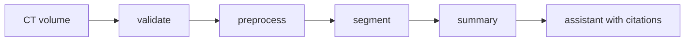
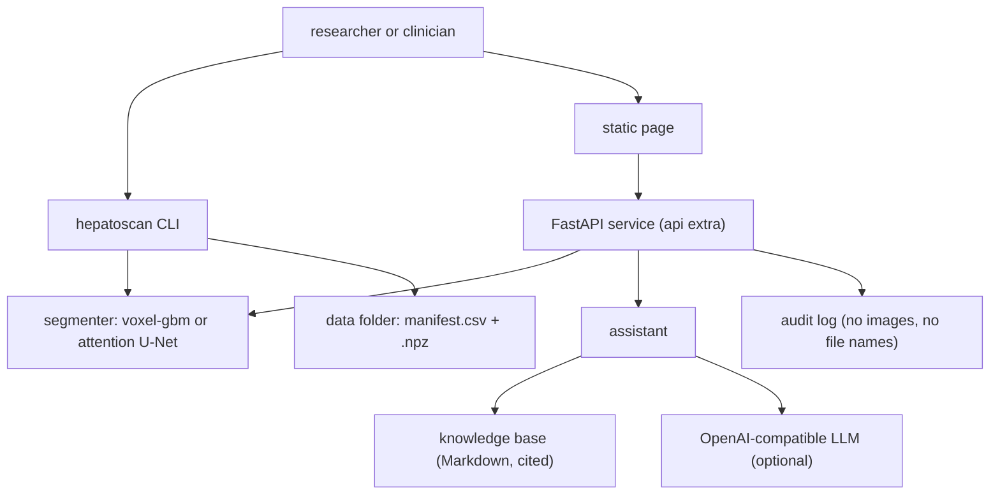
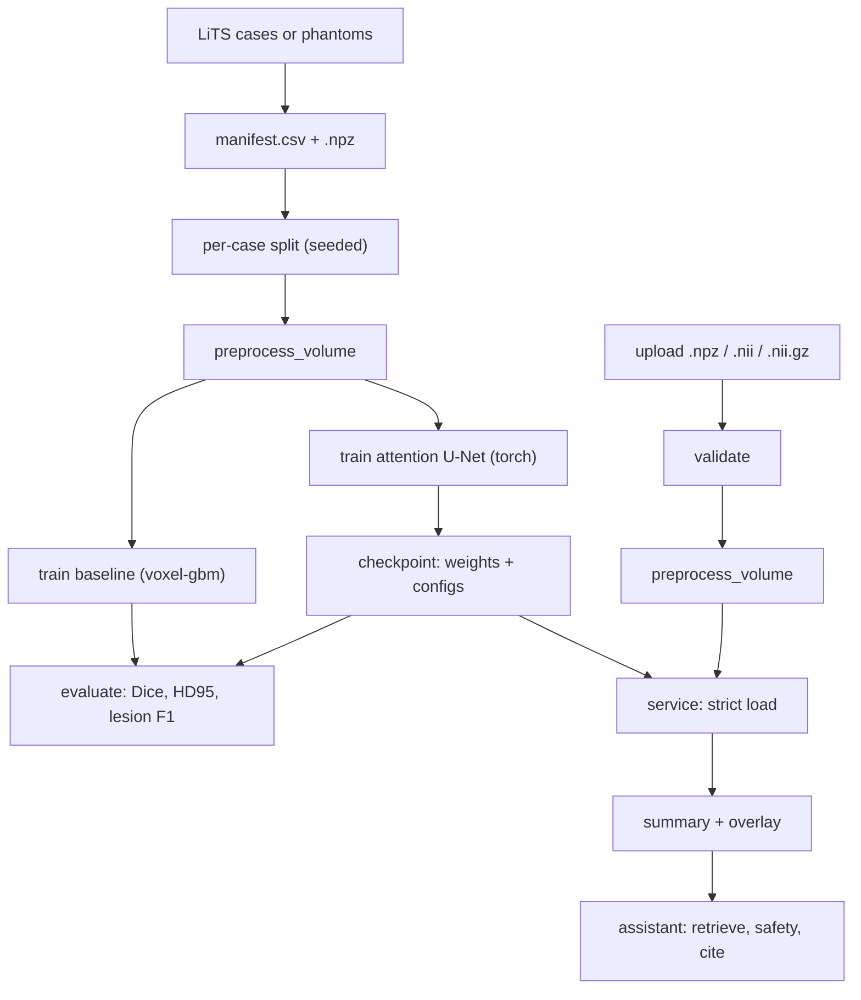

<div align="center">

# hepatoscan — Liver And Tumor Segmentation With A Safe Patient Assistant

**hepatoscan is a research and education toolkit for liver CT. It takes a CT volume through these steps to a reviewed-by-a-clinician measurement and grounded, non-diagnostic answers:**

`validate` → `preprocess` → `segment` → `measure` → `explain with citations`.


**[Summary](#1-summary)** ·
**[Workflow](#4-the-end-to-end-workflow)** ·
**[Run it](#10-how-to-run-hepatoscan)** ·
**[Configuration](#104-environment-variables)** ·
**[Known problems](#13-known-problems)** ·
**[Glossary](#15-glossary)**

</div>

> [!NOTE]
> This README uses ASD-STE100 Simplified Technical English. The writing rules and the project
> vocabulary are in [`docs/ste-style-guide.md`](docs/ste-style-guide.md). Each term in the
> [Glossary](#15-glossary) has only one meaning.

> [!WARNING]
> Do not use hepatoscan to make a medical decision. It is not a medical device and it gives no diagnosis.
> A qualified clinician must review every mask, every number and every answer.

---

hepatoscan segments the liver and liver tumors on CT volumes with three labels: background, liver and tumor. It measures each result per volume with Dice, HD95 and lesion detection, not with pixel accuracy. A small HTTP service accepts CT volumes only and keeps no copy of an upload. A patient assistant answers general questions from a curated knowledge base with citations, escalates emergency signs and refuses diagnosis, prognosis and dose questions.

This README is the **one location that explains all of hepatoscan**. It gives these topics:

- the general design
- each component and its procedure, step by step
- the decision rules
- the data map
- the runbook
- the validation results and the known problems

| If you are… | Read |
|---|---|
| A manager or reviewer | [1](#1-summary), [3](#3-design-rules), [4](#4-the-end-to-end-workflow), [12](#12-validation-results), [14](#14-key-points) |
| A developer who joins the project | All sections, in sequence. Keep [10](#10-how-to-run-hepatoscan) and [13](#13-known-problems) open while you work |
| An operator who runs hepatoscan | [10](#10-how-to-run-hepatoscan), then the section for the component that you use |

---

## Table of contents

1. 🧭 [Summary](#1-summary)
2. 🏗️ [How hepatoscan is built](#2-how-hepatoscan-is-built)
   - 2.1 [Components](#21-components)
   - 2.2 [System context](#22-system-context)
   - 2.3 [Repository layout](#23-repository-layout)
3. 🛡️ [Design rules](#3-design-rules)
4. 🔄 [The end-to-end workflow](#4-the-end-to-end-workflow)
   - 4.1 [Full flow](#41-full-flow)
   - 4.2 [The life cycle of one upload](#42-the-life-cycle-of-one-upload)
5. 🔵 [Data and preprocessing](#5-data-and-preprocessing)
6. 🟢 [The segmenters](#6-the-segmenters)
7. 🟣 [The service and the assistant](#7-the-service-and-the-assistant)
8. ⚖️ [The metrics, safety and service rules](#8-the-metrics-safety-and-service-rules)
9. 🗂️ [Data and file map](#9-data-and-file-map)
10. ▶️ [How to run hepatoscan](#10-how-to-run-hepatoscan)
    - 10.1 [Prerequisites](#101-prerequisites) · 10.2 [Installation](#102-installation) · 10.3 [Run hepatoscan](#103-run-hepatoscan) · 10.4 [Environment variables](#104-environment-variables)
11. 🧩 [How to extend hepatoscan](#11-how-to-extend-hepatoscan)
12. ✅ [Validation results](#12-validation-results)
13. ⚠️ [Known problems](#13-known-problems)
14. 📌 [Key points](#14-key-points)
15. 📖 [Glossary](#15-glossary)
16. 📄 [License](#16-license)

---

## 1. Summary

**The problem.** A liver segmentation demo is easy to make, but a demo can look correct and be wrong. The difficult questions are:

- Do the served weights match the trained model, or does the service run random weights?
- Does the loss see three labels, or does it mix liver and tumor?
- Does a metric show segmentation quality, or does background hide the errors?
- Does the service get the same input as the training, and does it refuse photos and screenshots?
- Can an assistant talk about a scan without a diagnosis, and does it escalate an emergency?

hepatoscan gives each of these questions its own component and its own tests.

| Item | Value |
|---|---|
| Input | A CT volume: `.npz`, `.nii` or `.nii.gz` in Hounsfield units |
| Output | A label mask, a summary (liver volume, lesion count, lesion volume), an overlay PNG, cited answers |
| Components | **7**: volume and labels, preprocessing, segmenters, metrics, service, assistant, CLI |
| Providers | PyTorch (U-Net), nibabel (NIfTI), FastAPI (service), any OpenAI-compatible LLM. All optional |
| Offline mode | Phantoms, the baseline segmenter, evaluation, the service logic and the extractive assistant |
| Safety | Strict checkpoint loading, CT-only uploads, no stored uploads, red-flag escalation, diagnosis refusal |
| Tests | **66** unit tests (`pytest`). In CI, 59 pass and 7 skip (torch and nibabel) |



---

## 2. How hepatoscan is built

### 2.1 Components

| Component | Module | Purpose |
|---|---|---|
| Labels | `src/hepatoscan/labels.py` | Label map 0/1/2, mask checks, nearest-neighbour resize |
| Volume | `src/hepatoscan/volume.py` | `Volume` type, schema checks, `.npz` and NIfTI input |
| Preprocessing | `src/hepatoscan/preprocess.py` | Resampling, CT windows, 2.5-D input. One path for training and serving |
| Splits | `src/hepatoscan/splits.py` | Seeded per-case train, validation and test sets |
| Phantoms | `src/hepatoscan/synthetic.py` | Synthetic volumes with exact masks, dataset folder input and output |
| Baseline | `src/hepatoscan/baseline.py` | Voxel gradient-boosting segmenter (scikit-learn pipeline) |
| U-Net | `src/hepatoscan/models/unet.py`, `train_unet.py` | 2.5-D attention U-Net, Dice plus cross-entropy, strict checkpoints (torch) |
| Clean-up | `src/hepatoscan/postprocess.py` | Largest liver component, tumor inside the liver, small lesions removed |
| Metrics | `src/hepatoscan/metrics.py`, `evaluate.py` | Dice, IoU, HD95, lesion detection, bootstrap intervals |
| Summary | `src/hepatoscan/segmenter.py`, `overlay.py` | Segmenter interface, volumes in mL, overlay image |
| Service | `src/hepatoscan/service/` | Upload checks, token check, audit log, FastAPI app, static page |
| Assistant | `src/hepatoscan/assistant/` | Knowledge base, BM25, safety rules, LLM adapters, sessions |
| CLI | `src/hepatoscan/cli.py` | The `hepatoscan` command |

### 2.2 System context



### 2.3 Repository layout

```
hepatoscan/
├── data/README.md               LiTS source, license, conversion, file schema
├── docs/ste-style-guide.md      writing rules and project vocabulary
├── src/hepatoscan/
│   ├── labels.py volume.py preprocess.py splits.py synthetic.py
│   ├── baseline.py postprocess.py segmenter.py overlay.py metrics.py evaluate.py
│   ├── models/                  attention U-Net, training, strict checkpoints (torch)
│   ├── service/                 validation, handlers, audit, FastAPI app, static page
│   ├── assistant/               kb/*.md, retriever, safety, llm, chat
│   ├── config.py                settings from environment variables
│   └── cli.py                   the hepatoscan command
├── tests/                       pytest suite
└── pyproject.toml               package, extras and the console script
```

---

## 3. Design rules

### 3.1 One model definition and strict loading
`models/unet.py` holds the only U-Net definition. A checkpoint stores the U-Net config and the preprocessing config with the weights. `load_checkpoint` uses `strict=True` and raises `CheckpointError` on any mismatch, so the service never runs random weights.

### 3.2 Three labels from end to end
Masks keep 0 = background, 1 = liver, 2 = tumor. `validate_mask` refuses fractional and unknown values. `resize_mask` uses nearest-neighbour sampling only. The U-Net uses a softmax head with cross-entropy plus Dice.

### 3.3 Per-volume metrics
`evaluate` reports Dice, IoU, HD95 and lesion detection per volume, with bootstrap intervals over volumes. It also reports pixel accuracy, only to show that background dominates it.

### 3.4 One preprocessing path
Training, evaluation and serving call `preprocess_volume` with the config that the segmenter carries. The service accepts CT volumes only and checks the content against the extension.

### 3.5 No stored uploads
The service processes an upload in memory. The client file name gives only the extension. The audit log records a content id, the size and the summary. It never records the image or the file name.

### 3.6 Grounded, non-diagnostic assistant
The assistant answers only from cited passages. Red flags give an escalation message with no model call. Diagnosis, prognosis and dose requests get a refusal first. A model answer with a diagnostic claim or with no valid citation is replaced by the extractive answer.

### 3.7 Server-side, capped sessions
The session history lives on the server, with a turn cap and a time limit. The page keeps the session id only in memory. It uses no `localStorage`, no cookies and no `innerHTML`.

### 3.8 Reproducible splits
`split_cases` makes disjoint train, validation and test sets of case ids from one seed. Validation and test never share a case.

---

## 4. The end-to-end workflow

### 4.1 Full flow



### 4.2 The life cycle of one upload

1. The client sends the bytes to `/segment` with the bearer token and an `X-Filename` header.
2. The service checks the token with a constant-time comparison.
3. The service checks the size, the extension and the magic bytes.
4. The volume loader checks the shape, the Hounsfield range and the spacing.
5. `preprocess_volume` resamples the volume and makes the CT windows.
6. The segmenter predicts the labels, and `clean_mask` removes anatomical errors.
7. The mask goes back to the original grid with nearest-neighbour sampling.
8. `summarize` measures the liver volume, the lesion count and the lesion volume.
9. The service writes one audit record and returns the summary and the overlay.
10. Nothing of the upload stays on the server after the response.

---

## 5. Data and preprocessing

**Purpose.** Give every segmenter the same, checked input.

| Input | Output |
|---|---|
| A `Volume` (HU array, spacing, optional mask) | `Prepared`: channels (C, D, H, W) in [0, 1], clipped HU, spacing, mask |

**Procedure**

1. Check the volume: 3-D, each axis 8 to 1024 voxels, finite values in [-2048, 4096] HU, spacing in (0, 20] mm.
2. Resample to the target spacing `(2.5, 1.5, 1.5)` mm: linear for the image, nearest neighbour for the mask.
3. Clip to [-1024, 1024] HU.
4. Make one channel per window: liver window (level 60, width 200) and abdomen window (level 40, width 400).
5. For the U-Net, stack the channels of each slice and its neighbour slices (`context = 1`).

**Rules**

- A mask must have only the labels 0, 1 and 2.
- The split is per case. All slices of a case stay in one split.
- Phantoms come from a seeded generator. A phantom has 0 to 3 hypodense lesions inside the liver.

---

## 6. The segmenters

**Purpose.** Return a label mask for a prepared volume.

| Segmenter | Module | Needs | Method |
|---|---|---|---|
| `voxel-gbm` | `baseline.py` | scikit-learn | Gradient boosting on 7 local features per voxel, then probability smoothing and clean-up |
| `attention-unet-2.5d` | `models/` | torch | 2-D U-Net with attention gates on 2.5-D input, softmax over 3 labels |

**Procedure (baseline)**

1. Compute 7 features per voxel: both windows, 3×3×3 mean and standard deviation, a wider mean, gradient magnitude, slice position.
2. Sample at most `per_class` voxels of each label from each training volume (seeded).
3. Fit the scikit-learn `Pipeline` (scaler, gradient boosting) on the training volumes only.
4. At prediction, smooth each label probability over 3×3×3 voxels and take the largest.
5. Apply `clean_mask`.

**Procedure (U-Net)**

1. Make 2.5-D slices. Keep 20% of the slices without liver. Crop or pad each slice to 96×96.
2. Train with Adam on cross-entropy plus the mean Dice loss of liver and tumor.
3. After each epoch, segment the validation volumes and compute the mean of liver Dice and tumor Dice.
4. Keep the best weights. Stop after `patience` epochs with no improvement.
5. Save the weights with the U-Net config and the preprocessing config.

**Rules**

- `TorchSegmenter` refuses a preprocessing config with a different number of windows than the U-Net expects.
- The baseline file loads only if its SHA-256 value matches its manifest. Never load a `.pkl` file from an unknown source.

---

## 7. The service and the assistant

**Purpose.** Give the segmentation and general information to a user with clear limits.

| Endpoint | Token | Input | Output |
|---|---|---|---|
| `GET /health` | No | none | status, segmenter name, LLM name |
| `GET /` | No | none | static page |
| `POST /segment` | Yes | raw bytes, `X-Filename` header | summary, overlay PNG (base64) |
| `POST /chat` | Yes | JSON `question`, optional `session_id`, `summary_text` | answer, citations, flags |
| `DELETE /chat/{session_id}` | Yes | none | `deleted` |

**Assistant procedure**

1. Reject an empty question or a question longer than 2000 characters.
2. If the question has a red flag, return the escalation message. Do not call the model.
3. Retrieve up to 3 passages with BM25. If there is no passage, return the no-information message.
4. Build the messages: the rules, the numbered passages, the scan summary (marked as not a diagnosis), the capped history and the question once.
5. Call the model. Remove citation markers that point to no passage.
6. If the answer has no valid citation or has a diagnostic claim, use the extractive answer.
7. If the question asks for a diagnosis, a prognosis or a dose, put the refusal first.
8. Add the source list and the disclaimer. Save the exchange in the session.

---

## 8. The metrics, safety and service rules

**Metrics.**

| Metric | Definition |
|---|---|
| `liver_dice`, `tumor_dice` | Dice of the liver region (labels 1 and 2) and of the tumor region (label 2). Two empty regions give 1 |
| `tumor_dice_cases_with_tumor` | Tumor Dice only on volumes with a true lesion |
| `liver_hd95_mm`, `tumor_hd95_mm` | 95th percentile of the symmetric surface distance in mm. One empty region gives infinity, which the mean leaves out |
| `lesion_recall`, `lesion_precision`, `lesion_f1` | Lesions are 26-connected components. A lesion is found if a predicted tumor voxel touches it |
| `pixel_accuracy` | Share of voxels with the correct label. Background dominates it |
| `liver_volume_error_ml`, `tumor_volume_error_ml` | Predicted minus true volume in mL |

Each summary gives the mean over volumes and a 95% percentile bootstrap interval (2000 resamples).

**Safety rules of the assistant.**

| Trigger | Examples | Action |
|---|---|---|
| Red flag | vomiting blood, black stools, severe abdominal pain, confusion, fainting, chest pain, breathing problems, suicidal thoughts | Escalation message, no model call |
| Diagnosis request | "do I have", "is it cancer", stage, prognosis, survival, dose, "should I stop" | Refusal first, then cited general information |
| Diagnostic claim in an answer | "you have cancer", "it is malignant", "take 500 mg" | Replace with the extractive answer |
| No passage | question outside the knowledge base | No-information message, no model call |

**Service rules.**

| Rule | Value |
|---|---|
| Accepted files | `.npz`, `.nii`, `.nii.gz`, with matching magic bytes |
| Size limit | `HEPATOSCAN_MAX_UPLOAD_MB` (default 64 MB). A `.nii.gz` file can expand to 8 times this limit |
| Token | `HEPATOSCAN_API_TOKEN`. If it is not set, protected endpoints answer 503 |
| Response headers | `Cache-Control: no-store`, `X-Content-Type-Options: nosniff`, a strict `Content-Security-Policy` |
| API docs | Off (`/docs` and `/openapi.json` answer 404) |
| LLM base URL | Must be `https`. Plain `http` is allowed only for `localhost` |
| Session | Cap of `HEPATOSCAN_MAX_HISTORY` exchanges, time limit `HEPATOSCAN_SESSION_TTL_S`, at most 1000 sessions |

---

## 9. Data and file map

| Path | Committed? | Contents |
|---|---|---|
| `data/README.md` | Yes | Data source, license and file schema |
| `data/synthetic/`, `data/lits/` | No (git ignores it) | `manifest.csv` and `.npz` volumes |
| `results/baseline.pkl`, `.json` | No (git ignores it) | Baseline model and its manifest with the SHA-256 value |
| `results/unet.pt`, `unet.json` | No (git ignores it) | U-Net checkpoint and its training history |
| `results/split.json` | No (git ignores it) | The case ids of each split |
| `results/eval_*.json` | No (git ignores it) | Evaluation reports |
| `results/audit.jsonl` | No (git ignores it) | Audit log of the service |
| `src/hepatoscan/assistant/kb/*.md` | Yes | Knowledge base |
| `.env` | No (git ignores it) | Local settings and secrets |
| `.env.example` | Yes | Names of the environment variables |

---

## 10. How to run hepatoscan

### 10.1 Prerequisites

| Need | For |
|---|---|
| Python 3.11+ | All components |
| PyTorch (`torch` extra) | `train-unet` and `.pt` models |
| nibabel (`nifti` extra) | `.nii` and `.nii.gz` input |
| FastAPI and uvicorn (`api` extra) | `serve` |
| Pillow (`image` extra) | Overlay PNG files |
| An OpenAI-compatible LLM endpoint | Optional. The assistant works offline without it |

### 10.2 Installation

```bash
git clone https://github.com/KrishnaAnnavaram/hepatoscan.git
cd hepatoscan
python -m venv .venv
. .venv/bin/activate            # Windows: .venv\Scripts\activate
pip install -e ".[dev]"         # core, tests and the FastAPI test client
pip install -e ".[all]"         # torch, nibabel, FastAPI server and Pillow (optional)
```

### 10.3 Run hepatoscan

```bash
# offline demo: phantoms, baseline, evaluation, one segmentation, two assistant questions
hepatoscan demo

# phantoms or converted LiTS cases (see data/README.md)
hepatoscan synth --cases 30 --out data/synthetic
hepatoscan train-baseline --data data/synthetic
hepatoscan evaluate --data data/synthetic --model results/baseline.pkl

# attention U-Net (torch extra)
hepatoscan train-unet --data data/synthetic --epochs 10
hepatoscan evaluate --data data/synthetic --model results/unet.pt

# one volume
hepatoscan segment data/synthetic/case_000.npz --model results/baseline.pkl --out-dir results/case_000
hepatoscan ask "What does the lesion count mean?" --summary results/case_000/case_000_summary.json

# HTTP service (api extra); set HEPATOSCAN_API_TOKEN first
hepatoscan serve --model results/baseline.pkl --host 127.0.0.1 --port 8000
```

### 10.4 Environment variables

| Variable | Used by | Meaning |
|---|---|---|
| `HEPATOSCAN_DATA_DIR` | `synth`, `train-*`, `evaluate` | Dataset folder. Default `data/synthetic` |
| `HEPATOSCAN_RESULTS_DIR` | all commands with output | Output folder. Default `results` |
| `HEPATOSCAN_MODEL_PATH` | `segment`, `serve` | Default model file (`.pkl` or `.pt`) |
| `HEPATOSCAN_DEVICE` | U-Net | `auto`, `cpu` or `cuda`. Default `auto` |
| `HEPATOSCAN_API_TOKEN` | service | Bearer token. No default: protected endpoints are off without it |
| `HEPATOSCAN_MAX_UPLOAD_MB` | service | Upload limit. Default `64` |
| `HEPATOSCAN_AUDIT_LOG` | service | Audit file. Default `results/audit.jsonl` |
| `HEPATOSCAN_LLM_PROVIDER` | assistant | `offline` (default) or `openai` (any OpenAI-compatible server) |
| `HEPATOSCAN_LLM_BASE_URL` | assistant | Default `https://api.openai.com/v1` |
| `HEPATOSCAN_LLM_MODEL` | assistant | Default `gpt-4o-mini` |
| `HEPATOSCAN_LLM_API_KEY` | assistant | API key of the LLM provider |
| `HEPATOSCAN_LLM_TIMEOUT_S` | assistant | Default `30` |
| `HEPATOSCAN_MAX_HISTORY` | assistant | Exchanges kept per session. Default `6` |
| `HEPATOSCAN_SESSION_TTL_S` | assistant | Session time limit in seconds. Default `1800` |

The CLI reads a local `.env` file for these names. A variable that is already set wins. Credentials are only in the local `.env` file. Git ignores this file. Do not print or commit credentials.

---

## 11. How to extend hepatoscan

| You want to… | Do this | Code change? |
|---|---|---|
| Use LiTS | Convert the cases as `data/README.md` shows, then run `train-*` and `evaluate` with `--data` | No |
| Use a hosted or local LLM | Set `HEPATOSCAN_LLM_PROVIDER=openai` and the base URL, the model and the key | No |
| Add a knowledge-base page | Add a Markdown file with `title` and `source` front-matter to `assistant/kb/` | No |
| Add a red flag or a refusal pattern | Add a regular expression to `safety.py` and a test | Small |
| Add a segmenter | Write a class with `name`, `preprocess` and `predict_prepared(prep)` | Small |
| Add a 3-D model | Add a module in `models/` that returns a `TorchSegmenter`-like object | Yes |
| Accept DICOM | Add a DICOM reader to `volume.py` and a magic-byte check to `validation.py` | Yes |

---

## 12. Validation results

All numbers come from synthetic phantoms on one laptop CPU. Phantoms are much simpler than real CT. The numbers show that the pipeline runs end to end. They say nothing about clinical performance.

| Validation | Result | Command |
|---|---|---|
| Unit tests (torch, nibabel and FastAPI installed) | **66 passed** | `pytest -q` |
| Unit tests in CI (no torch, no nibabel) | **59 passed, 2 skipped (7 tests)** | `pip install -e ".[dev]"` then `pytest -q` |
| Phantom evaluation, 30 cases, test split of 8 cases | See the table below | `hepatoscan synth --cases 30` then `train-*` and `evaluate` |

Phantoms: 30 cases of 24×64×64 voxels, seed 0. Split: 18 train, 4 validation, 8 test cases (4 test cases have lesions). The U-Net uses `base = 16`, 10 epochs at most, and stopped early after epoch 8 (best epoch 5). Each cell gives the mean over the 8 test volumes and the 95% bootstrap interval.

| Metric | `voxel-gbm` | `attention-unet-2.5d` |
|---|---|---|
| Liver Dice | 0.920 [0.910, 0.931] | 0.928 [0.921, 0.933] |
| Tumor Dice, cases with a lesion (n = 4) | 0.584 [0.382, 0.734] | 0.789 [0.759, 0.811] |
| Liver HD95 (mm) | 2.28 [2.03, 2.50] | 2.25 [2.11, 2.46] |
| Tumor HD95 (mm, finite cases) | 7.01 [0.75, 15.03] (n = 7) | 1.13 [0.35, 1.92] (n = 8) |
| Lesion recall | 0.938 [0.813, 1.000] | 1.000 [1.000, 1.000] |
| Lesion precision | 0.781 [0.500, 1.000] | 0.938 [0.813, 1.000] |
| Lesion F1 | 0.758 [0.500, 1.000] | 0.958 [0.875, 1.000] |
| Pixel accuracy | 0.991 | 0.992 |

Pixel accuracy is above 0.99 for both segmenters, but the tumor Dice differs by 0.2. This shows why pixel accuracy is not a segmentation metric. With 8 test volumes the intervals are wide. The phantoms are easy, so these numbers are an upper bound for this code, not an estimate for real CT.

The prototype reported only pixel accuracy, and its service probably ran with random weights. There is no prototype number to compare.

---

## 13. Known problems

Read these problems before you use hepatoscan in any setting with real patients.

| # | Area | Problem | Impact and action |
|---|---|---|---|
| 1 | Results | No result on real CT is reproduced in this repository or in CI | Convert LiTS and evaluate before you trust a segmenter |
| 2 | Model | The U-Net is 2.5-D, not 3-D, and is not compared with nnU-Net | Use a 3-D baseline for a research claim |
| 3 | Input | DICOM is not supported. Only `.npz`, `.nii` and `.nii.gz` | Convert DICOM series to NIfTI first |
| 4 | Knowledge base | The knowledge-base text is written for this project and is not clinically reviewed | A clinician must review it before any use with patients |
| 5 | Safety rules | The red-flag and refusal rules are regular expressions in English | They can miss other words, typing errors and other languages |
| 6 | Service | Sessions are in memory. A restart deletes them, and several workers do not share them | Use one worker, or add a shared store |
| 7 | Service | There is one shared bearer token, no user accounts and no rate limit | Put the service behind an identity provider and a gateway |
| 8 | Bias | LiTS comes from a small number of hospitals and scanners | Results can differ on other populations, scanners and contrast phases |
| 9 | Baseline | The baseline file is a pickle | Load only files that you made. The SHA-256 check stops changed files, not unsafe sources |

**Responsible use.** hepatoscan is not a medical decision tool. Human review by a qualified clinician is required for every output. Datasets such as LiTS have bias in their populations and scanners.

---

## 14. Key points

1. **The service never runs random weights.** A checkpoint that does not fit the model definition stops the load.
2. **Liver and tumor stay separate.** Three labels, nearest-neighbour resizing and a softmax loss.
3. **Metrics are per volume.** Dice, HD95 and lesion detection with intervals, not pixel accuracy.
4. **Uploads are CT volumes only and leave no trace.** No public folder, no file name in the logs.
5. **The assistant cites, escalates and refuses.** It gives no diagnosis, no prognosis and no dose.

---

## 15. Glossary

| Term | Meaning |
|---|---|
| **volume** | One 3-D CT image in Hounsfield units, with its spacing |
| **case** | One volume with its mask and its `case_id` |
| **mask** | A 3-D array of labels with the shape of the volume |
| **label** | `0` background, `1` liver, `2` tumor |
| **liver region** | All voxels with label 1 or 2 |
| **tumor region** | All voxels with label 2 |
| **lesion** | One connected component of the tumor region |
| **phantom** | A synthetic volume with an exact mask |
| **window** | A Hounsfield range that is scaled to [0, 1] |
| **2.5-D input** | The channels of one slice and its neighbour slices |
| **segmenter** | A component that returns a mask: `voxel-gbm` or `attention-unet-2.5d` |
| **checkpoint** | A `.pt` file with the weights, the U-Net config and the preprocessing config |
| **summary** | Liver volume, lesion count and lesion volume of one mask |
| **Dice** | `2 |A ∩ B| / (|A| + |B|)` for a predicted region A and a true region B |
| **HD95** | 95th percentile of the symmetric surface distance, in mm |
| **red flag** | A phrase that can describe an emergency |
| **escalation** | The fixed message that tells the user to get urgent care |
| **refusal** | The fixed non-diagnostic message |
| **session** | The server-side history of one conversation |

---

## 16. License

[MIT](LICENSE) © 2026 Krishna Annavaram
